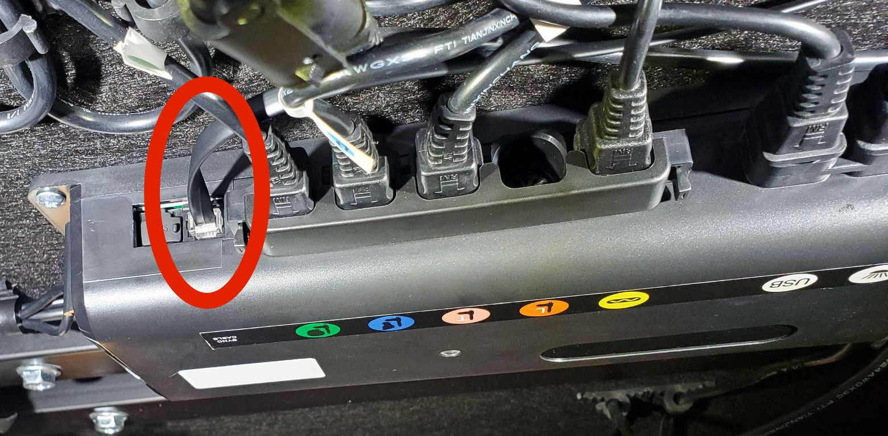
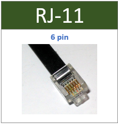
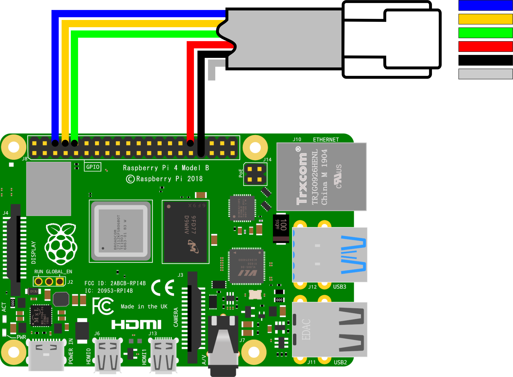
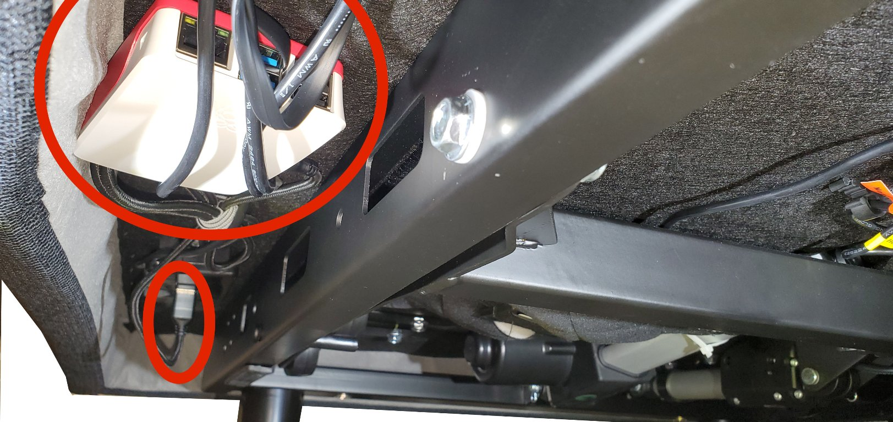
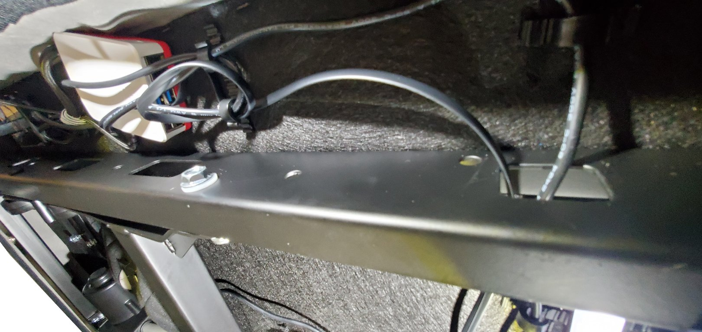
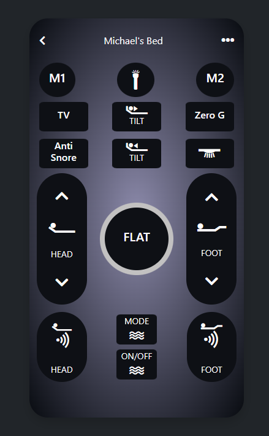
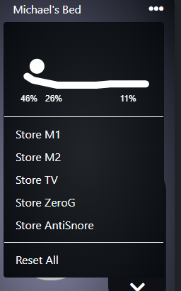
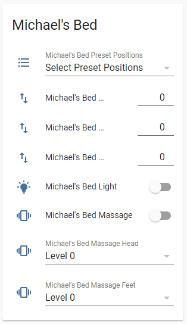

# Sven & Son Automation

## 1 Overview

This project allows to operate a [Sven&Son](https://svenandson.com/) smart bed from a Raspberry Pi with cheap hardware costing less than a few dollars. It comes with a Web Interface that allows the control of the bed without the traditional remote control from any Web Browser or Smart Phone It also offers an MQTT interface with discovery to [Home Assistant](https://www.home-assistant.io/), so that one can integrate the various functions of the bed with Smart Home Control. This allows for turning the bed lights on based on other events such as light switches in the room. It also allows to raise and lower the bed either based on given automation event or via Amazon Alexa if the later is linked to Home Assistant. Finally, it allows the massage feature to be turned on automatically based on Amazon Alexa or other alarms (if linked to Home Assistant), which is an excellent way to wake up

## 2 Hardware

This project has been developed and tested with a Raspberry Pi 4 as the base platforms. Since the serial port and network are the only external ports used, the program could be used on other platforms with minor modifications and testing. It needs to be linked to the bed using a connection cable (see below).

The Sven&Son bed I used to develop the integration is a Sven & Son Adjustable Bed Base, Classic+ Series ([Order from Amazon](https://www.amazon.com/gp/product/B07LGFJGQ4)). The bed does not come with Bluetooth or any Android/iPhone integration. But in all likelihood, this should work with any Sven&Son bed in the Essentials, Classic, Bliss & Platinum Series. The key point here is the control hardware the bed is using. This integration is made for the [Qingdao Richmat](http://richmat-us.com/product.aspx?BaseInfoCateId=87&CateId=87) HJC9 control box. So if you bed uses the control box (located below the bed) that looks like the below picture, this automation will likely work:



2 points to note here:
1. It is critical that your control box has a 6 pin RJ11 port fit for a cable connector looking like this: <br/><br/> The port is likely labeled as "**Sync Cable**"
1. I have so far only been able to test it with my bed/control box. If your bed is using the same Richmat control box but from a different brand or a different model of Sven&Son, I'd be keen to hear from you if this is working.


As of now, you have to build your own hardware. Here are the steps to do so, this should not take long and does not require specialized tools unless you choose to do so.
1.) simply order any 6P6C Telephone line cord ([Order](https://www.ebay.com/itm/173978854169?hash=item2881f2a319:g:tUYAAOSwDNdV4Vwx)) and cut of one end of the cord. Then connect it to your Raspberry Pi 4 as follow:

1. You can use any method you like to connect the cut end of the wire to the GPIO ports of the Raspberry Pi. I find Dupond connectors useful & neat [Order](https://www.ebay.com/itm/294249650607?hash=item4482a559af:g:X64AAOSwpHZg2nbv)
1. If you prefer to use different GPIO ports on Raspberry Pi, you can do so, but need to update your config file later on to point to the correct ports.
1. Now plug in the RJ12 connector to the Richmat Control box in the port labeled "Sync Cable":

1. It's entirely possible to leave the Raspberry Pi dangling or on the floor. I find it useful to mount it near USB ports of the bed, so I can power it from there. So I simply tugged it in below some cables:



And you are done on the hardware!

## 3 Software

If you are new to using a Raspberry Pi and Linux please refer to other sources for coming up to speed with the environment. Having a base knowledge will go a long way. This [site](https://www.raspberrypi.org/help/) is a great place to start if you are new to these topics.

If you are not familiar with remote login commands for Linux/Unix, two useful commands if you are not using a GUI on your raspberry pi are "ssh" and "scp". These commands allow you to run your Pi without a monitor or user interface. These programs allow you to remotely login to your Pi and remotely transfer files to your Pi. This [page](https://linuxacademy.com/blog/linux/ssh-and-scp-howto-tips-tricks/) describes both programs. You can also do a web search on these programs to find other resources on their use. In short you need to have at minimum a basic understanding of using a command line, preferably some experience with Linux and the ability to transfer files to a Raspberry Pi and execute them.

The Raspberry Pi organization has documentation on installing an operating system on your Raspberry Pi. It is located [here](https://www.raspberrypi.org/documentation/installation/installing-images/README.md).

One the Pi has its basic setup (an operating system and an internet connection) working, ssh into your Raspberry Pi and you should find that you are in the directory /home/pi. Note: if you prefer not to use a headless system, you can also open a terminal windows directly on the Pi.

The next step is to download the Sven&Son Software from the Github repository to your Raspberry Pi. The easiest way to do this is to use the "git" program. Most Raspberry Pi distributions include the git program (except Debian Lite).

Whether or not it is already installed, it's good practice to type the following:

```sh
sudo apt-get update
sudo apt-get install git
```
(If git isn't installed, it will install it; if it was previously, it will update it)

Once git is installed on your system, make sure you are in the /home/pi directory, then type:

```sh
git clone https://github.com/MichaelB2018/svenson-mqtt-bridge.git
```

The above command will make a directory in /home/pi named svenson-mqtt-bridge and put the project files in this directory.

Next, we need to install Python Libraries. Before doing so, you have to decide whether you want to run the Sven&Son MQTT bridge in Python 2 or Python 3. The library supports both, but Python 3 is suggested. So, to proceed in Python 3, you need to ensure pip3 is installed:

If the program 'pip3' is not installed on your system, type:

```sh
sudo apt-get update
sudo apt-get install python3-pip
```
    
If you decided to use Python 2, the last command will read instead:

```sh
sudo apt-get install python-pip
```

Next, we need to install the PIGPIO libraries, to do so, type:

```sh
sudo apt-get install pigpio
```

Next install the required Python Libraries:

```sh
sudo pip3 install paho-mqtt tendo
```
   
If you decided to use Python 2, the last command will read instead:

```sh
sudo pip install paho-mqtt tendo
```

Next, let's test if it all works. Start <svenson-mqtt-bridge.py> by typing:

```sh
sudo python3 /home/pi/svenson-mqtt-bridge/svenson-mqtt-bridge.py
```

You should not see any error messages here.

## 4 Usage

Note that the config file won't exists the first time you run the application. In that case, a new config file will be created based on the name you specified (e.g. /home/pi/svenson-mqtt-bridge/svenson-mqtt-bridge.conf). Once it has been created, you can modify it to change your need (SSL or not, which port is used, etc.), it will not be erased with an update. If you messed up something, just delete it and relaunch svenson-mqtt-bridge.py, a new vanilla copy will be generated.

The recommended operation mode is to start the software by typing:
```sh
sudo python3 /home/pi/svenson-mqtt-bridge/svenson-mqtt-bridge.py
```    

You can also automatically start the software when your Raspberry Pi starts
```sh
sudo crontab –e
```
Note, that "crontab -e" will just open a console-based text editor that you can edit the crontab script. The first time you run "crontab -e" you will be prompted to choose the editor. I recommend nano. From the crontab window, add the following to the bottom of the crontab script

```
@reboot sleep 60;sudo /home/pi/svenson-mqtt-bridge/svenson-mqtt-bridge.py
0 * * * * sudo /home/pi/svenson-mqtt-bridge/svenson-mqtt-bridge.py
```

And save the crontab schedule. (if using nano type press ctrl-o to save the file, ctrl-x to exit nano). Now, every time your system is booted operateShutters will start.

The program is not known to crash. Hence restarting it every hour is not really required. But it does not hurt either. So up to you if you wish to use both of the above lines or just the first one. In any case, you will need to restart your Raspberry Pi once you have completed step 4. To do so, type "sudo reboot".

To stop the program from running in the background, type:

```sh
sudo pkill –f svenson-mqtt-bridge.py
```

## 5 Web GUI

Using your web-browser, navigate to: http://IPaddressOfYouPi:80

The Web interface resembles the physical remote control and operation is straight forward. Note that the up and down need to be held for the adjustment to continue - just like on the physical remote.



The 3 dots on the top right hand side help to program the bed:



The first 5 options allow you to store the current position of the bed. the 6th option ("Reset All") helps to reset all the stored position to the factory default. Note that "Reset All" will take about 10 minutes and requires to raise and lower your bed to the various positions. So only operate the "Reset All" if you are not in bed!

Final note here is for users of Android or iPohe devices. You can select "Add To Home" screen (or similar) from your browser of your smart phone. This will allow you to access your bed's remote directly from the home screen of your device.

## 6 MQTT Integration (e.g. for Home Assistant)

While the MQTT integration was written specifically for [Home Assistant](https://www.home-assistant.io/), nothing is stopping the use of this integration for other purpose. But more on this later

First, to use this integration, make sure you configure your `operateShutters.conf` with the right parameters. Look out for the following lines:

```
MQTT_Server = 192.168.1.x
MQTT_Port = 1883
MQTT_User = xxxxxxx
MQTT_Password = xxxxxxx
```
and make sure they match the setup of you MQTT Broker. If you are using Home Assistant, you can conveniently use the "Mosquitto broker" add-on inside Home Assistant. For more information refer to the relevant [Documentation](https://github.com/home-assistant/hassio-addons/tree/master/mosquitto)

If you choose not to use the Home Assistant add-in, you can download the [Mosquitto Broker](https://mosquitto.org/) and refer to the [Broker configuration](https://mosquitto.org/man/mosquitto-8.html)

If you choose not to use the MQTT integration, simply leave the config value for MQTT_Server blank and the integration will be disabled.

### a.) you use Home Assistant's [MQTT Discovery functionality](https://www.home-assistant.io/docs/mqtt/discovery/).

To do so, add the following line to `svenson-mqtt-bridge.conf`

```
EnableDiscovery = true
```

and also add the following line to your `svenson-mqtt-bridge.yaml` in Home Assistant:

```
mqtt:
  discovery: true
```
   
Note that both the svenson-mqtt-bridge & Home Assistant need to be restarted before this will work. Home Assistant will henceforth auto discover your bed.

### b.) Don't use Home Assistants MQTT Discovery functionality.

If so, no further changes are required to `svenson-mqtt-bridge.conf`. However you will have to add lines to `configuration.yaml` in Home Assistant for ever functionality of your bed you wish to use
Finally, in case of any difficulties with this integration, 2 more useful commands:

### a.) See messages on the MQTT Broker
If you want to see what messages are passed on the MQTT Broker, you can use the following to listen to all messages (assuming you set up mosquitto with a username and password):

```
mosquitto_sub -h 192.168.x.x -p 1883 -u [username]-P [password] -t '#' -v
```

### b.) Send messages to the MQTT Broker, for the svenson-mqtt-bridge to pick up
If you want to post a message to the MQTT Broker for your svenson-mqtt-bridge to pick up, you can use following to send messages (assuming you set up mosquitto with a username and password):

```
mosquitto_pub -h 192.168.x.x -p 1883 -u [username]-P [password] -t 'home/svenson/select/command/MyBed_preset' -m 'M2'
mosquitto_pub -h 192.168.x.x -p 1883 -u [username]-P [password] -t 'home/svenson/select/command/MyBed_preset' -m 'Flat'
```

Those 2 command will rise and lower your bed. Note that the section **MyBed** will be adjusted if you choose a different name for your bed in svenson-mqtt-bridge.conf under the section "name".

Finally, you can set up Home Assistant's Lovelace GUI to control your bed from there. Obviously you have many options, I chose a pretty basic layout:



To set this up, use the following configuration text in your Lovelace Raw Configuration Editor.
```
 - type: entities
        entities:
          - entity: select.my_bed_preset_positions
          - entity: number.my_bed_tilt_level
          - entity: number.my_bed_head_level
          - entity: number.my_bed_feet_level
          - entity: switch.my_bed_light
          - entity: switch.my_bed_massage
          - entity: select.my_bed_massage_head
          - entity: select.my_bed_massage_feet
        title: My Bed
        state_color: true
        show_header_toggle: false
```

Note again that the term **my_bed** will be adjusted if you choose a different name for your bed in svenson-mqtt-bridge.conf under the section "name".

## 7 Additional Information
The Sync port is obviously made to connect 2 beds (likely a Split King) to ensure that the beds move in sync. However this is not documented n the manual and repeated calls to the vendor to sell me a split cable went unanswered. So if you are just interested in a sync cable, you can make this yourself using cheap RJ12 P6C6 connectors  [Order](https://www.ebay.com/itm/393536559928?epid=1707509278&hash=item5ba09b5b38:g:su0AAOSwlRNhKXGU) and a 6 Conductor Flat Modular Line Cord [Order](https://www.showmecables.com/89-350-193-bk?gclid=CjwKCAjw2vOLBhBPEiwAjEeK9solxEAq65zqyEKRCsE6wkvLs0uS2bMHigPTeO7wp67jKc09wo9gYxoC-gsQAvD_BwE). I find it easier & cheaper to order a normal Telephone Line Cable [Order](https://www.ebay.com/itm/400973901474?epid=1839933136&hash=item5d5be82ea2:g:7y4AAOSwDNdVxQAs)  and to replace one end of the connector. Note that the wiring needs to match the below for the sync cable to work:


But again, you do not need such a sync cable for this automation. This is just if you are looking to sync 2 beds without automation.


## 8 License


[Attribution-NonCommercial-ShareAlike 4.0 International (CC BY-NC-SA 4.0)](https://creativecommons.org/licenses/by-nc-sa/4.0/)


