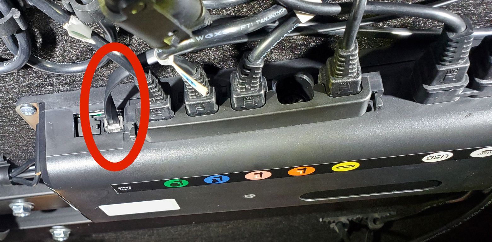
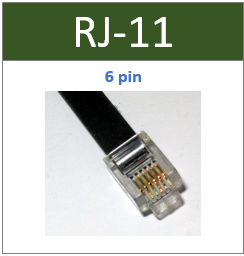
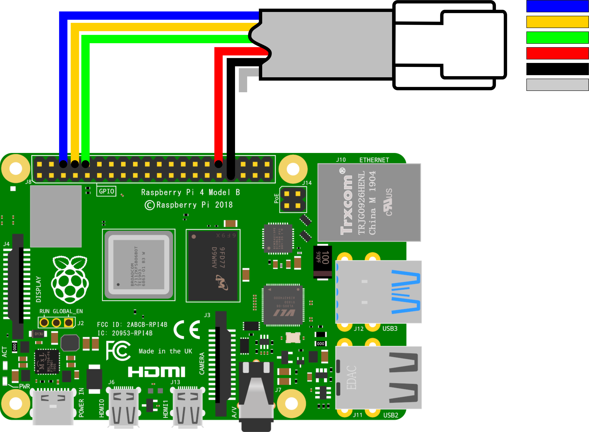
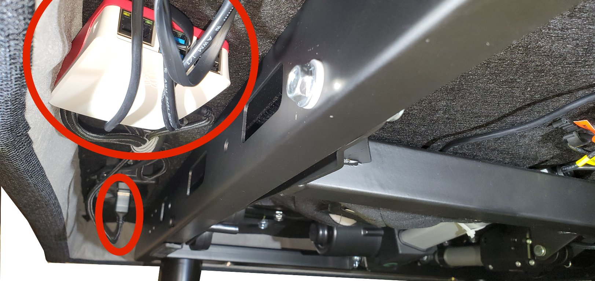
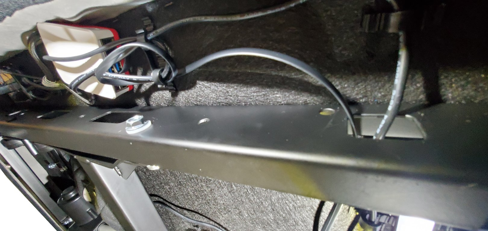
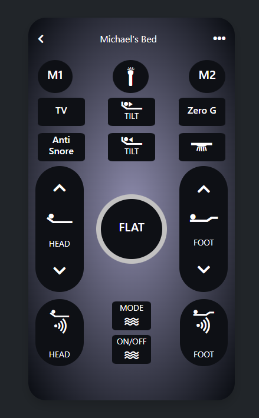
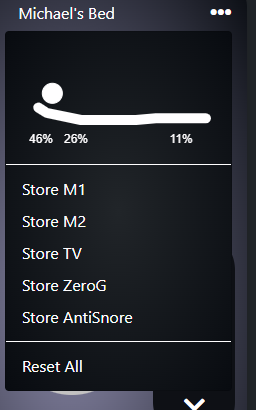
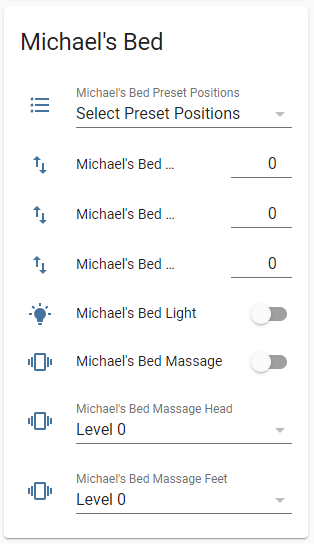

# Sven & Son MQTT Bridge

Control your [Sven & Son](https://svenandson.com/) adjustable bed from a Raspberry Pi — with a web remote, MQTT, and Home Assistant integration.

## Overview

This project lets you operate a Sven & Son smart bed from a Raspberry Pi using inexpensive hardware (a few dollars at most). It provides:

- **Web Interface** — control the bed from any browser or smartphone, no physical remote needed.
- **MQTT Integration** — publish and subscribe to bed commands via an MQTT broker.
- **Home Assistant Discovery** — auto-discovered entities for head, feet, tilt, light, massage, and preset positions.

With Home Assistant, you can turn bed lights on from a light switch, raise or lower the bed via automation or Alexa, and even start the massage feature as a wake-up alarm.

## Hardware

### Compatibility

This project has been developed and tested on a **Raspberry Pi Zero W** and **Raspberry Pi 4**. Since only the serial port and network are used, it could run on other platforms with minor modifications.

The integration is built for the [Qingdao Richmat](http://richmat-us.com/product.aspx?BaseInfoCateId=87&CateId=87) **HJC9 control box**. It was developed with the Sven & Son Adjustable Bed Base, Classic+ Series ([Amazon](https://www.amazon.com/gp/product/B07LGFJGQ4)), but should work with any Sven & Son bed in the Essentials, Classic, Bliss, or Platinum Series — or any bed using this control box:



**Important:**
1. Your control box must have a **6-pin RJ11 port** (likely labeled "**Sync Cable**"):<br/>
2. This has only been tested on one bed/control box so far. If yours uses the same Richmat HJC9 box (same brand or different), I'd love to hear whether it works for you.

### Wiring

1. Order a 6P6C telephone line cord ([example](https://www.ebay.com/itm/173978854169)) and cut off one end.
2. Connect the wires to your Raspberry Pi GPIO as shown:<br/>
3. You can use DuPont connectors ([example](https://www.ebay.com/itm/294249650607)) or any method you prefer. If you use different GPIO pins, update the config file accordingly.
4. Plug the RJ12 connector into the "Sync Cable" port on the Richmat control box:<br/>
5. Mount the Pi wherever is convenient — for example, tucked near the bed's USB ports for power:<br/><br/>

## Software Installation

A basic familiarity with the Linux command line and SSH is assumed. If you are new to Raspberry Pi, the [official documentation](https://www.raspberrypi.com/documentation/) is a great starting point.

### 1. Clone the Repository

SSH into your Raspberry Pi, then:

```sh
sudo apt-get update
sudo apt-get install git pigpio
git clone https://github.com/MichaelB2018/svenson-mqtt-bridge.git
cd svenson-mqtt-bridge
```

### 2. Install Python Dependencies

```sh
sudo pip3 install -r requirements.txt
```

### 3. Test It

```sh
sudo python3 /home/pi/svenson-mqtt-bridge/svenson-mqtt-bridge.py
```

You should not see any error messages.

## Usage

### Configuration

The first time you run the application, a config file (`svenson-mqtt-bridge.conf`) is created from the default template. Edit it to match your setup (SSL, port, MQTT broker, GPIO pins, etc.). The config file is never overwritten by updates — if you need a fresh copy, delete it and restart the application.

### Running

Start manually:

```sh
sudo python3 /home/pi/svenson-mqtt-bridge/svenson-mqtt-bridge.py
```

### Auto-Start on Boot

Edit the root crontab:

```sh
sudo crontab -e
```

Add the following lines:

```
@reboot sleep 60; sudo /home/pi/svenson-mqtt-bridge/svenson-mqtt-bridge.py
0 * * * * sudo /home/pi/svenson-mqtt-bridge/svenson-mqtt-bridge.py
```

The first line starts the bridge 60 seconds after boot. The second restarts it hourly as a safety net (the program is not known to crash, so the second line is optional). Reboot your Pi after saving.

### Stopping

```sh
sudo pkill -f svenson-mqtt-bridge.py
```

## Web Interface

Navigate to `http://<your-pi-ip>:80` in any browser.

The web interface resembles the physical remote control — operation is straightforward. Hold the up/down buttons for continuous adjustment, just like the physical remote.



Tap the three dots in the top-right corner to access programming options:



The first five options store the current bed position to a preset. The "Reset All" option recalibrates all stored positions to factory defaults — this takes about 10 minutes and moves the bed through its full range, so **do not use it while in bed**.

> **Tip:** On Android or iPhone, use your browser's "Add to Home Screen" option to create an app-like shortcut to the bed remote.

## MQTT Integration

While built specifically for [Home Assistant](https://www.home-assistant.io/), the MQTT interface works with any MQTT-based system.

### Broker Setup

Configure the MQTT section in `svenson-mqtt-bridge.conf`:

```ini
MQTT_Server = 192.168.1.x
MQTT_Port = 1883
MQTT_User = your_username
MQTT_Password = your_password
```

These must match your MQTT broker settings. If you use Home Assistant, the [Mosquitto broker add-on](https://github.com/home-assistant/hassio-addons/tree/master/mosquitto) is a convenient option. Alternatively, you can install [Mosquitto](https://mosquitto.org/) standalone and refer to the [broker documentation](https://mosquitto.org/man/mosquitto-8.html).

To disable MQTT, leave `MQTT_Server` blank.

### Option A: Home Assistant MQTT Discovery (Recommended)

Add to `svenson-mqtt-bridge.conf`:

```ini
EnableDiscovery = true
```

Add to your Home Assistant `configuration.yaml`:

```yaml
mqtt:
  discovery: true
```

Restart both the bridge and Home Assistant. Your bed will be auto-discovered.

### Option B: Manual Entity Configuration

If you prefer not to use discovery, no changes are needed in `svenson-mqtt-bridge.conf`. Instead, manually add entities to `configuration.yaml` for each bed function you want to expose.

### Debugging MQTT

**Listen to all messages** on the broker:

```sh
mosquitto_sub -h 192.168.x.x -p 1883 -u [username] -P [password] -t '#' -v
```

**Send a command** to the bed:

```sh
mosquitto_pub -h 192.168.x.x -p 1883 -u [username] -P [password] -t 'home/svenson/select/command/MyBed_preset' -m 'M2'
mosquitto_pub -h 192.168.x.x -p 1883 -u [username] -P [password] -t 'home/svenson/select/command/MyBed_preset' -m 'Flat'
```

Note that **MyBed** is replaced by the name you set in `svenson-mqtt-bridge.conf` under `name`.

### Home Assistant Lovelace Example



Add this to your Lovelace raw configuration:

```yaml
- type: entities
  entities:
    - entity: select.my_bed_preset_positions
    - entity: number.my_bed_tilt_level
    - entity: number.my_bed_head_level
    - entity: number.my_bed_feet_level
    - entity: switch.my_bed_light
    - entity: switch.my_bed_massage
    - entity: select.my_bed_massage_head
    - entity: select.my_bed_massage_feet
  title: My Bed
  state_color: true
  show_header_toggle: false
```

Replace `my_bed` with your configured bed name.

## Sync Cable (Optional)

The "Sync Cable" port is designed to connect two beds (e.g., a split king) so they move in unison. This is not needed for this automation project, but if you want to build a sync cable yourself:

Use RJ12 6P6C connectors ([example](https://www.ebay.com/itm/393536559928)) with a 6-conductor flat modular cord ([example](https://www.showmecables.com/89-350-193-bk)). Alternatively, buy a standard telephone line cable ([example](https://www.ebay.com/itm/400973901474)) and replace one connector. The wiring must match:


## License


[Attribution-NonCommercial-ShareAlike 4.0 International (CC BY-NC-SA 4.0)](https://creativecommons.org/licenses/by-nc-sa/4.0/)


